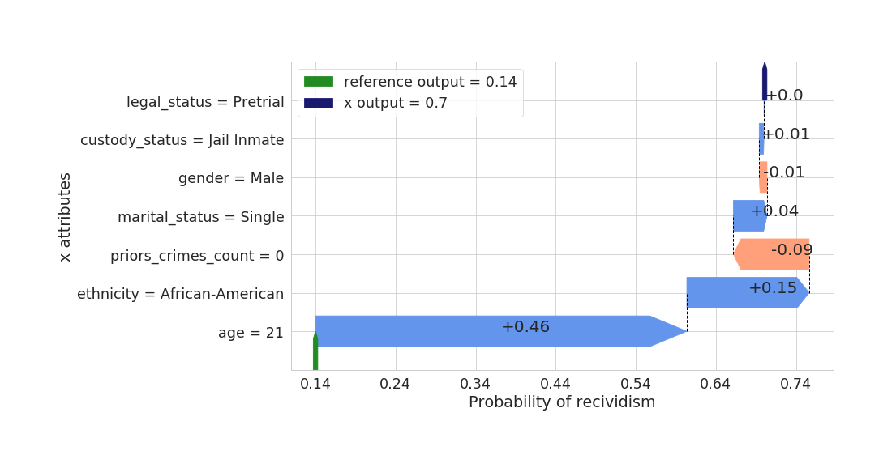

# Shapkit
> Interpret machine learning predictions using agnostic local feature importance based on Shapley Values. Documentation: https://thalesgroup.github.io/shapkit/


## Overview

### Objective

Machine Learning is enjoying an increasing success in many applications: medical, marketing, defense, cyber security, transport. It is becoming a key tool in critical systems. However, models are often very complex and highly non-linear. This is problematic, especially for critical systems, because end-users need to fully understand decisions of an algorithm (e.g. why an alert has been triggered, why a person has a high probability of cancer recurrence,. . . ). One solution is to offer an interpretation for each individual prediction based on attribute relevance. Shapley Values allow to distribute fairly contributions for each attribute in order to understand the difference between a predicted value for an observation and a base value (e.g. the average prediction of a reference population).

The method used is:
* **agnostic**: no particular information on the model is needed, it works with black box algorithms. We only define a reward funtion (e.g. the model output).
* **local**: the explanation is computed at instance level. Thus, each interpretation is associated to a given prediction.
* More suitable for **tabular data** with meaningful features.

### A concrete use case: COMPAS

> *COMPAS (Correctional Offender Management Profiling for Alternative Sanctions) is a popular commercial algorithm used by judges and parole officers for scoring criminal defendant’s likelihood of reoffending (recidivism)*

Assume that we have trained a machine learning model to predict the probability of recividism of a given individual. The algorithm is quite effective but it only returns a probability score without any details on how it has made its choice.
We would like to know how each attribute (characteristic) influences the model output. Furthermore, contributions explain the difference between the individual prediction and the mean prediction for all references. These references are defined by the user (e.g. for classification, interesting references are selected into other predicted classes).



This picture displays the kind of interpretation associated to a given prediction for individual x. We want to understand the model decision associated to an individual x. As an example, here the individual  has a probability of 70% to reoffend. (the blue tick at top right).
Attribute importance are computed with respect to one or several references. On this example, we chose only non predicted recividists as good elements of comparison. The mean probability for that group of references is about 14% (green tick at the bottom left).
Finally, the gap between our individual prediction and the mean reference prediction is splitted by the attribute importance. The sum of all contributions equals that difference. 
Now, we can analyze that the age (21 years old) and the ethnicity of the individual x increase respectively by 46% and 15% the estimated probability of recidivism. In the meantime, the fact that he has never commited any crimes decreases the probability by 9%.

## Install

```
pip install shapkit
```

## Dependencies

* [python3](https://www.python.org/downloads/) (>= 3.6)
* [numpy](https://numpy.org/) (>= 1.17.2)
* [pandas](https://pandas.pydata.org/) (>= 0.25.3)
* [matplotlib](https://matplotlib.org/) (>= 2.2.3)
* [seaborn](https://seaborn.pydata.org/) (>= 0.9.0)
* [tqdm](https://github.com/tqdm/tqdm) [optional] (>= 4.26.0)

```
pip install -r requirements.txt
```

## How to use

The method is a post-hoc explanation, so you do not have to change your routine. Firstly, train your model:
```python
model.fit(X_train, y_train)
```

Then, define your reward function `fc` (e.g. simply set by your model output):
```python
fc = lambda x: model.predict_proba(x)
```

Select an instance `x` for which you need more interpretation. Pick also one or several `reference(s)` (instance or dataset of individuals). 
If the number of features is not too high (said lower than 10), you can compute the exact Shapley Values.
```python
true_shap = ShapleyValues(x=x, fc=fc, ref=reference)
```

If the dimension exceeds about 15, then you may need approximation algorithms to estimate the Shapley Values. 

* Monte Carlo algorithm:

```python
mc_shap = MonteCarloShapley(x=x, fc=fc, ref=reference, n_iter=1000)
```


* Projected Stochastic Gradient Descent algorithm:

```python
sgd_est = SGDshapley(d, C=y.max())
sgd_shap = sgd_est.sgd(x=x, fc=fc, ref=reference, n_iter=5000, step=.1, step_type="sqrt")
```

## Code and description

This library is based on [nbdev](http://nbdev.fast.ai/). If you want to modify the lib or run tests, you will have to install it.
> nbdev is a library that allows you to fully develop a library in Jupyter Notebooks, putting all your code, tests and documentation in one place. That is:you now have a true literate programming environment, as envisioned by Donald Knuth back in 1983!

Codes, descriptions, small examples and tests are all put together in jupyter notebooks in the folder `nbs`.

Usefull commands from `nbdev`:

* Build your lib by converting all notebooks in folder `nbs` to .py files
```
 nbdev_build_lib
```


* Run all tests in parallel
```
nbdev_test_nbs
```


* Build docs
```
nbdev_build_docs
```

## Tutorial

Notebook demos are availables in `tutorials` folder.

## License

Shapkit is licensed under the terms of the MIT License (see the file LICENSE).

## Main reference

*A Projected SGD algorithm for estimating Shapley Value applied in attribute importance*, S. Grah, V. Thouvenot, CD-MAKE 2020
