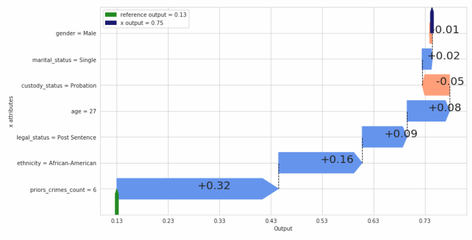

# Shapkit
> Interpret machine learning predictions by using agnostic local feature importance based on Shapley Values. 


## Overview

### Objective

Machine Learning is enjoying an increasing success in many applications: medical, marketing, defense, cyber security, transport. It is becoming a key tool in critical systems. However, models are often very complex and highly non-linear. This is problematic, especially for critical systems, because end-users need to fully understand decisions of an algorithm (e.g. why an alert has been triggered, why a person has a high probability of cancer recurrence,. . . ). One solution is to offer an interpretation for each individual prediction based on attribute relevance. Shapley Values allow to distribute fairly contributions for each attribute in order to understand the difference between a predicted value for an observation and a base value (e.g. the average prediction of a reference population).

The method used is:
* **agnostic**: no particular information on the model is needed, it works with black box algorithms. We only define an reward funtion (e.g. the model output).
* **local**: the explanation is computed at instance level. Interpretation associated to a given prediction.
* More suitable for tabular data with meaningful features.

### A concrete use case: COMPAS

> *COMPAS (Correctional Offender Management Profiling for Alternative Sanctions) is a popular commercial algorithm used by judges and parole officers for scoring criminal defendant’s likelihood of reoffending (recidivism)*

Assume that we have trained a machine learning model in order to predict probability of recividism of a given individual. The algorithm is quite effective but it only returns a probability score without any details on how it has made its choice.
What we would like is to get an idea of each individual attributes (characteristics) contributes to explain the difference between the individual prediction and the mean prediction made on other instances called the references. These references are defined by the user (e.g. for classification, interesting references are selected into other predicted classes).



This picture displays the interpretation associated to a given prediction for individual x. The estimated probability of recidivism is about 0,75 (deep blue arrow). The attributes (or characteristics) of that individual are showed in the y axis. Based on a set of chosen references (here the references are predicted as non recidivist by the model), we compute contributions (Shapley Values) of each attribute related to their influence on the model output. 
Those contributions have some interesting properties. Indeed, the sum of all contributions equals the difference between the output of the individual x (0,75) and the mean output of references (0,13).

On this example, the fact that this person has commited 6 priors crime, is African-American and 27 years old, his legal status is Post Sentence, are mainly explained why the model has predicted such probability score. The contributions could also be negative, e.g. his probation custody status influences the model towards a low probability of recividism.

## Install

```
pip install shapkit
```

## How to use

The method is a post-hoc explanation, so you do not have to change your routine. Firstly, train your model:
```python
model.fit(X_train, y_train)
```

Then, define your reward function `fc` (e.g. simply set by your model output):
```python
fc = lambda x: model.predict_proba(x)
```

Select an instance `x` for which you need more interpretation. Pick also one or several `reference(s)` (instance or dataset of individuals). 
If the number of features is not too high (said lower than 10), you can compute the exact Shapley Values.
```python
true_shap = ShapleyValues(x=x, fc=fc, ref=reference)
```

If the dimension exceeds about 15, then you may need approximation algorithms to estimate the Shapley Values. 

* Monte Carlo algorithm:

```python
mc_shap = MonteCarloShapley(x=x, fc=fc, ref=reference, n_iter=1000)
```


* Projected Stochastic Gradient Descent algorithm:

```python
sgd_est = SGDshapley(d, C=y.max())
sgd_shap = sgd_est.sgd(x=x, fc=fc, r=reference, n_iter=5000, step=.1, step_type="sqrt")
```

## Code and description

This library is based on [nbdev](http://nbdev.fast.ai/).
> nbdev is a library that allows you to fully develop a library in Jupyter Notebooks, putting all your code, tests and documentation in one place. That is:you now have a true literate programming environment, as envisioned by Donald Knuth back in 1983!
Codes, descriptions, small examples and tests are all put together in jupyter notebooks in the folder `nbs`.

Usefull commands from `nbdev`:

* Build your lib by converting all notebooks in folder `nbs` to .py files
```
 nbdev_build_lib
```


* Run all tests in parallel
```
nbdev_test_nbs
```


* Build docs
```
nbdev_build_docs
```
